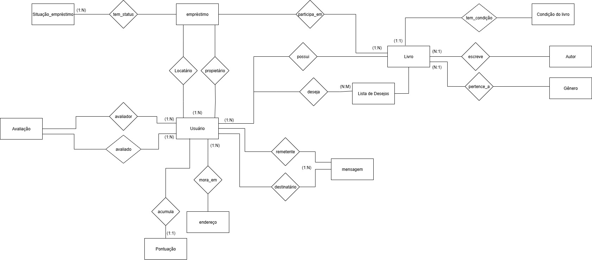

# Modelagem de Banco de Dados - Plataforma de Troca de Livros

Este projeto apresenta a modelagem de banco de dados para uma **plataforma de economia colaborativa**, voltada ao compartilhamento e empréstimo de livros físicos entre usuários.  
O objetivo é fomentar a troca justa, sustentável e acessível, reduzindo custos e incentivando a circulação de conhecimento.

---

## 1. Objetivo da Plataforma
Criar uma base de dados que suporte as principais funcionalidades de uma plataforma de trocas de livros físicos, permitindo:
- Cadastro de usuários e seus endereços
- Registro de livros disponíveis para empréstimo
- Controle de empréstimos, histórico e avaliações
- Gestão de pontos (gamificação)
- Comunicação entre usuários

---

## 2. Requisitos da Plataforma
### Requisitos Funcionais
- Usuários devem se cadastrar com dados básicos e endereço.
- Usuários podem cadastrar livros que possuem, vinculados a autores e gêneros.
- O sistema deve permitir gerenciar empréstimos (status, datas, histórico).
- Deve existir um sistema de **avaliação** e **pontuação** para promover confiança.
- Usuários podem adicionar livros a uma lista de desejos.
- Comunicação via mensagens entre usuários deve ser registrada.

### Requisitos Não Funcionais
- Segurança de dados sensíveis (senhas com hash).
- Escalabilidade para suportar crescimento do número de usuários/livros.
- Consistência dos dados (restrições de integridade no banco).

---

## 3. Identificação das Entidades e Atributos
### Usuários
- id_usuario (PK)
- nome  
- email  
- senha (hash)  
- data_nascimento  
- telefone  
- reputacao  
- status_usuario  
- data_cadastro  

### Livros
- id_livro (PK)  
- titulo  
- id_autor (FK)  
- id_genero (FK)  
- id_usuario_dono (FK)  
- pontos  
- id_condicao (FK)  
- ano_publicacao  
- editora  
- isbn  

### Autores
- id_autor (PK)  
- nome_autor  
- nacionalidade  
- data_nascimento  

### Gênero
- id_genero (PK)  
- nome_genero  

### Condição do Livro
- id_condicao (PK)  
- descricao  

### Pontuação
- id_pontuacao (PK)  
- id_usuario (FK)  
- pontos_totais  
- pontos_disponiveis  
- pontos_ganhos  

### Empréstimo
- id_situacao (PK)  
- descricao  

### Avaliação
- id_avaliacao (PK)  
- id_usuario_avaliador (FK)  
- id_usuario_avaliado (FK)  
- nota  
- comentario  
- data_avaliacao  

### Histórico de Trocas
- id_historico (PK)  
- id_usuario (FK)  
- id_livro (FK)  
- id_situacao (FK)  
- data_inicio  
- data_fim  

### Endereço
- id_endereco (PK)  
- id_usuario (FK)  
- cep  
- rua  
- numero  
- complemento  
- bairro  
- cidade  
- estado  

### Mensagem
- id_mensagem (PK)  
- id_remetente (FK)  
- id_destinatario (FK)  
- conteudo  
- data_envio  
- status  

### Lista de Desejos
- id_lista (PK)  
- id_usuario (FK)  
- id_livro (FK)  
- data_adicao

### Situação do Empréstimo
- id_situacao (PK)
- descricao
- ativo 

---

## 4. Relacionamentos
- Um **usuário** pode cadastrar vários **livros**.  
- Um **livro** pertence a um **autor** e a um **gênero**.  
- Um **usuário** pode ter vários **endereços** (ou um principal).  
- Um **usuário** pode avaliar outro **usuário**.  
- Um **livro** pode estar em várias situações de empréstimo ao longo do tempo.  
- O **histórico de trocas** conecta usuários, livros e situações.  
- Usuários podem enviar **mensagens** entre si.  
- Usuários podem montar uma **lista de desejos** de livros.  

---

## 5. Diagrama Entidade-Relacionamento (DER)

---

## 7. Autoria
Projeto desenvolvido para a disciplina **Laboratório de Banco de Dados**, por Liz Martins.
